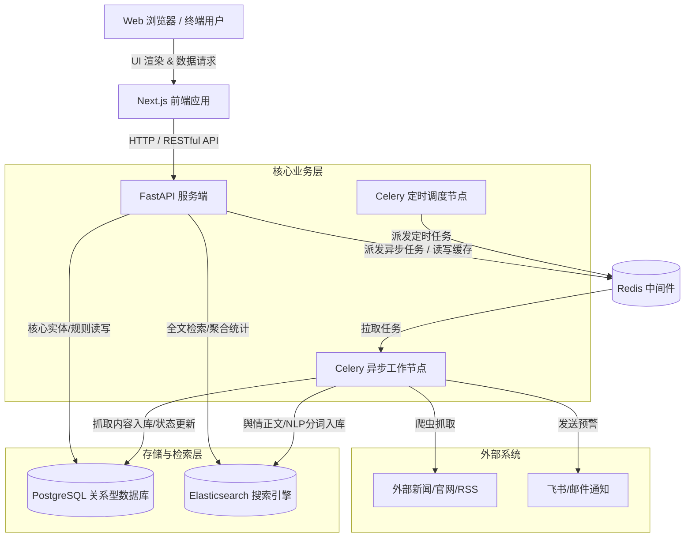

# OpinionSentinel 软件架构设计

OpinionSentinel 采用前后端分离的“同仓双应用”（Monorepo）结构，不仅兼顾了现代化前端的交互体验，又利用高并发的异步处理机制满足长耗时的舆情抓取和报表生成需求。

## 1. 整体架构图

以下是系统整体架构的数据流转与组件交互示意图：

## 2. 核心模块说明

### 2.1 表现层 (Frontend)
- **技术栈**：Next.js (App Router), React, TailwindCSS。
- **职责**：
  - 提供用户交互的可视化界面（总览看板、舆情列表、规则配置等）。
  - 处理用户鉴权、表单校验。
  - SSR (服务端渲染) 与 CSR (客户端渲染) 结合，提供流畅的操作体验。

### 2.2 接口接入层 (API Server)
- **技术栈**：Python 3.x, FastAPI, Pydantic, SQLAlchemy。
- **职责**：
  - 作为前后端交互的网关，提供高并发响应的 REST API 接口。
  - 处理规则增删改查、触发手动报表生成等业务逻辑校验。
  - 向 Redis 写入耗时操作任务，避免阻塞主线程响应。

### 2.3 异步与定时任务调度层 (Task Workers)
- **技术栈**：Celery, Redis。
- **职责**：
  - **Celery Worker**：真正的“苦力”。在后台异步执行网络爬虫抓取、大批量数据清洗与 NLP 情感分析、PDF/HTML 报表的渲染和导出，以及预警消息触发（如邮件、飞书机器人）。
  - **Celery Beat**：定时器。可根据配置的时间策略（如每天上午9点）准时把抓取任务或日报任务扔进 Redis 队列。

### 2.4 数据持久化与搜索引擎层 (Data & Storage)
为保证海量文本数据检索性能与业务关系一致性的平衡，采用异构数据存储方案：
- **PostgreSQL**：专门用于存放结构化的核心业务数据。如：用户信息、监控关键词库、系统规则、任务执行状态等。强保证事务和数据一致性。
- **Elasticsearch**：用作大规模舆情文章的全文搜索引擎，并负责舆情词云、情感倾向分布等高维度的统计聚合分析（Aggregation）。
- **Redis**：充当 Celery 的消息代理（Broker）和结果后端（Result Backend），同时兼具高频 API 接口的查询缓存功能。

## 3. 典型业务数据流
**以“自动预警”为例：**
1. 运营人员通过 **Next.js 前端** 创建一条针对竞争对手的监控规则。
2. **FastAPI** 接收到请求后，将此规则固化存储到 **PostgreSQL**。
3. **Celery Beat** 触发定时的爬虫任务，并将相关指令发送至 **Redis**。
4. **Celery Worker** 领到任务，去各大网站拉取新闻，将新闻元数据存入 **PG**，新闻全文与清洗后的 NLP 数据放入 **Elasticsearch**。
5. 保存时，触发规则校验流程。若发现文章中包含大量负面词汇，命中报警规则。
6. Worker 随即调用外部 API (如飞书 webhook) 发送预警通知，整个过程对前端无感。
